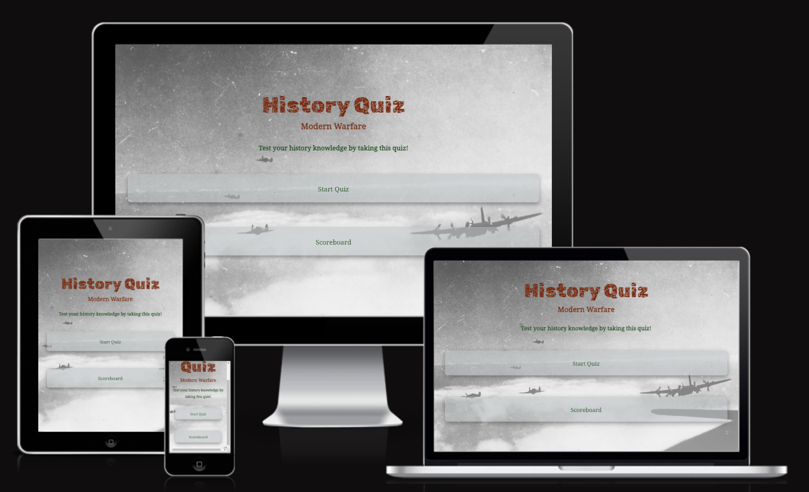
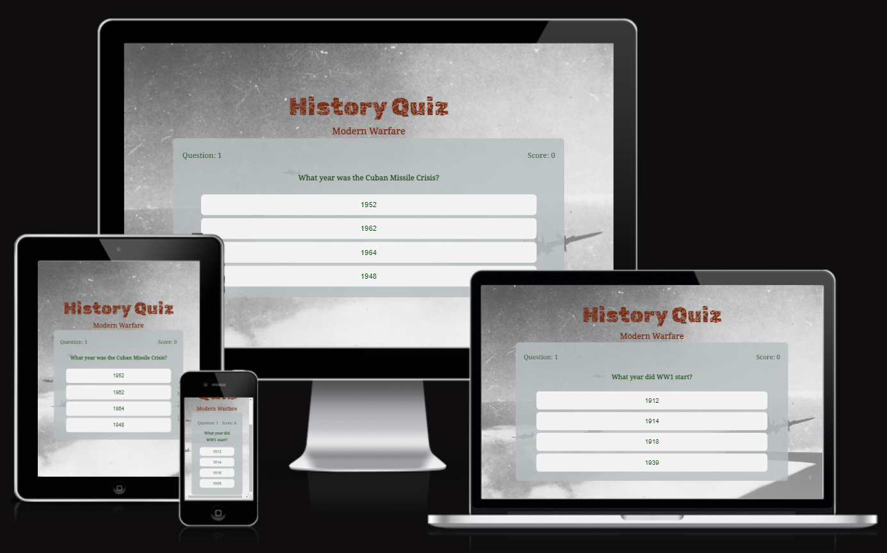
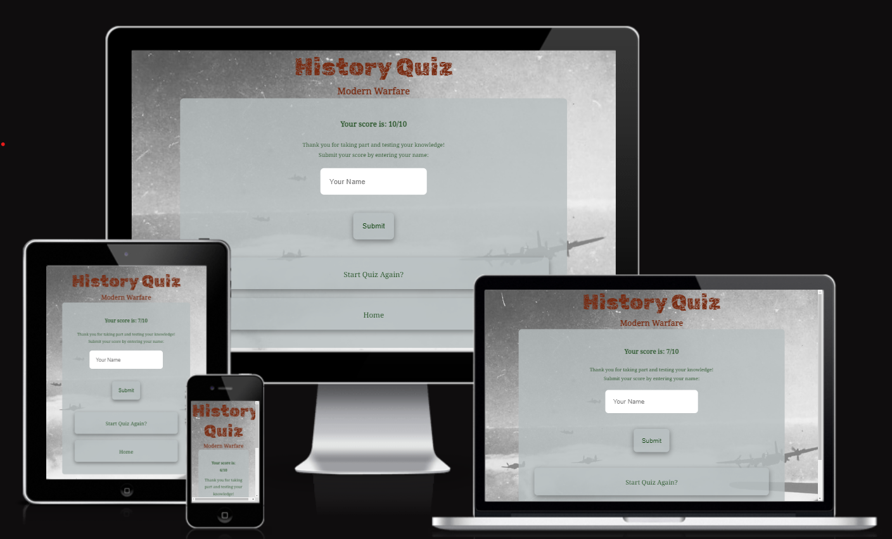
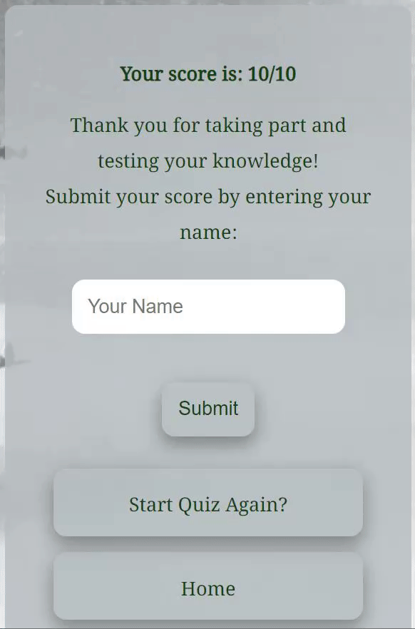
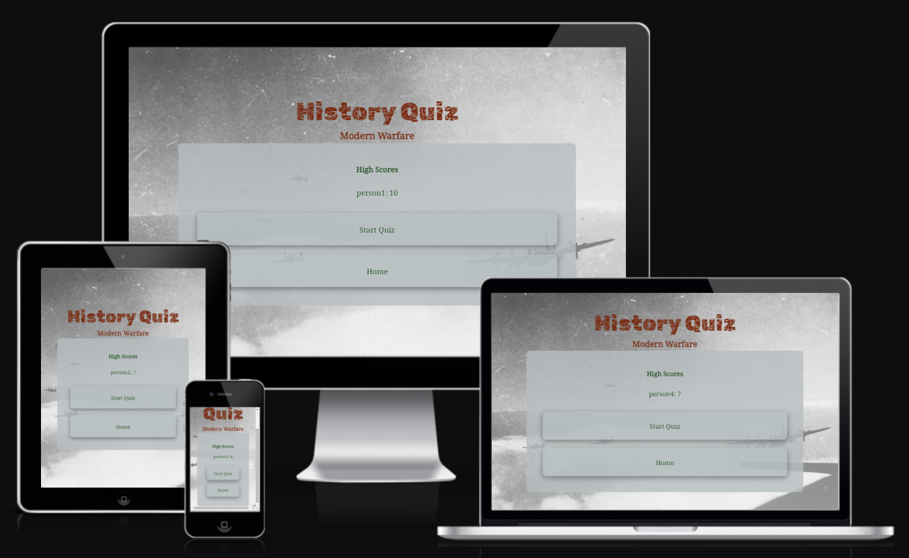
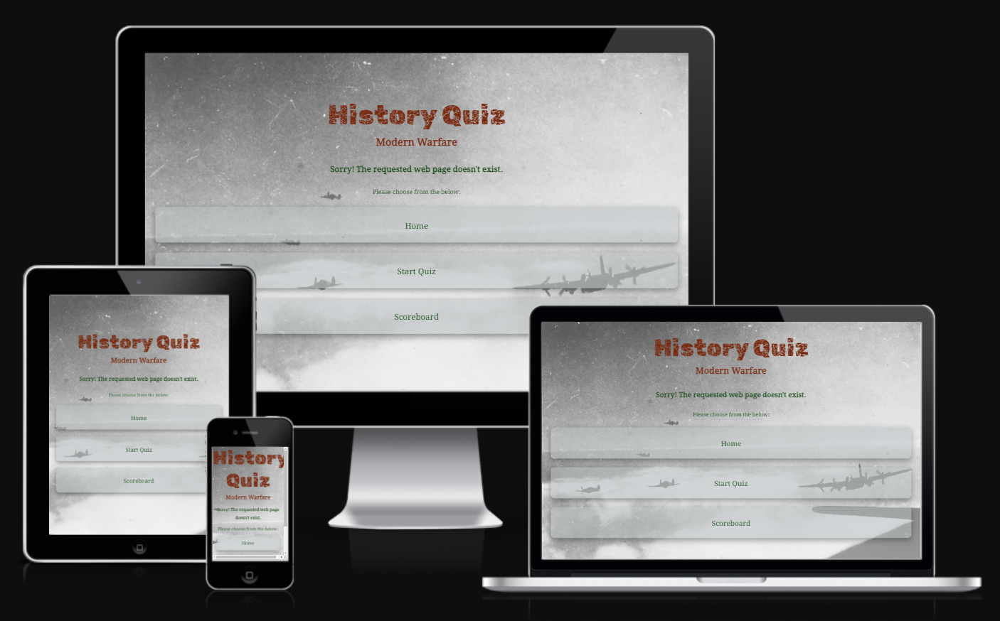

# History Quiz - Modern Warfare

This history quiz is designed to test your knowledge on trivia related to modern warfare. It is a short quiz which covers the period from the end of the 19th century to present day.

The home page directs you to start the quiz or view the scoreboard where the top 5 high scorers are ranked. The quiz consists of 10 multiple choice questions. Upon completion you receive a total score and an option to submit your score by entering your name.

[View quiz on Github Pages](https://sarohia94.github.io/Project-2-History-Quiz/)

* [User Experience (UX)](#User-Experience-(UX))
  * [Initial Discussion](#Initial-Discussion)
  * [User Stories](#User-Stories)

* [Design](#Design)
  * [Colour Scheme](#Colour-Scheme)
  * [Typography](#Typography)
  * [Imagery](#Imagery)
  * [Wireframes](#Wireframes)
  * [Features](#Features)
  * [Accessibility](#Accessibility)

* [Technologies Used](#Technologies-Used)
  * [Languages Used](#Languages-Used)
  * [Frameworks, Libraries & Programs Used](#Frameworks,-Libraries-&-Programs-Used)

* [Testing](#Testing)
  * [W3C Validator](#W3C-Validator)
  * [Solved Bugs](#Solved-Bugs)
  * [Known Bugs](#Known-Bugs)
  * [Testing User Stories](#Testing-User-Stories)
  * [Lighthouse](#Lighthouse)
  * [Manual Testing](#Manual-Testing)

  * [Deployment](#Deployment)
    * [Local Deployment](#Local-Deployment)
    * [Remote Deployment](#Remote-Deployment)
  
* [Credits](#Credits)
  * [Code](#Code)
  * [Content](#Content)
  * [Media](#Media)
  * [Acknowledgments](#Acknowledgments)

- - -

## User Experience (UX)

### Initial Discussion
A multiple choice quiz to test knowlege on modern warfare history.

#### Key information for the site:

* What is being tested
* A 10 question, multiple choice quiz
* A scoreboard which ranks the top 5 high scorers
* On completing the quiz, an option to submit your name and score 

### User Stories

#### Client Goals

* To make it responsive so that users are able to view the site on a range of device sizes.
* To make it easy for users to interact with the website intuitively.
* To make it available to use any time and any where.

#### First Time Visitor Goals

* I want to understand the purpose of the site and what is being quized before I start.
* I want to be able to navigate the site easily so that I can take the quiz.
* I want to test my history knowledge in modern warfare to see how well I perform.
* I want to be given instant feedback as I pick the correct or incorrect answers.
* I want to be given my final score on completion so that I know how I perfomed.

#### Returning Visitor Goals

* I want to be able to retake the quiz to see if I have improved from the first time.
* I want to be able to submit my name and score, so that this might be logged on the scoreboard.
* I want to be able to view the scoreboard to see the top 5 scorers name and score.

#### Frequent Visitor Goals

* I want to be able to take longer quizes or quizes with increasing difficulty to test my knowledge.

- - -

## Design

### Colour Scheme
This was obtained from the [Coolors](https://coolors.co/) website. 
The colours used for text are #78290F and #114411 as they stand out against the background image and nicely complement eachother. 
The containers for the quiz and scoreboard and the buttons use #B6BEBF and #F3F3F4 which provides a clean look against the background image used.

### Typography

Google Fonts were used as below:

* Rubik Distressed is used for the title, as I liked the distressed look. I think this fits the aesthetic associated with modern warfare.

* Noto Serif Khojki is used for the body of the text. It is a sans-serif font. This provides a nice clean look for the core body of the text for easy readability and it juxtaposes well against the title text.

### Imagery

One image was used for the background, which I think nicely sets the theme of the website without being too distracting. The image used of the sky with war planes was taken from the [War History Online](https://www.warhistoryonline.com/wp-content/uploads/sites/64/2018/08/no-15-squadron-raf-stirlings-mk-i-and-hurricane-escorts-1.jpg) website and can be found in the credits section.

### Wireframes

Wireframes were created for destop, tablet and mobile.

* Home page wireframe can be found for [desktop](docs/wireframes/desktop-home.png), [tablet](docs/wireframes/tablet-home.png) and [mobile](docs/wireframes/mobile-home.png).

* Quiz page wireframe can be found for [desktop](docs/wireframes/desktop-question.png), [tablet](docs/wireframes/tablet-question.png) and [mobile](docs/wireframes/mobile-question.png).

* Submit score page wireframe can be found for [desktop](docs/wireframes/desktop-final-score.png), [tablet](docs/wireframes/tablet-final-score.png) and [mobile](docs/wireframes/mobile-final-score.png).

* Scoreboard page wireframe can be found for [desktop](docs/wireframes/desktop-scoreboard.png), [tablet](docs/wireframes/tablet-scoreboard.png) and [mobile](docs/wireframes/mobile-scoreboard.png).

### Features

Website consists of a home page, a quiz page, a scoreboard page and a 404 error page.
The website is responsive on a range of device sizes and has:
* A favicon implemented in the browser tab 
  
  
  
* The title and subtitle at the top of every page. Where the title is a clickable link back to the home page.

  

* Home page
  * The home page has a brief introductory message before providing two buttons to either start the quiz or view the scoreboard.

    

  * The buttons change color when hovered over to bring them to attention to the user.

    

* Quiz page
  * The quiz page shows the question number, score count, question and four answer choices. 

    

  * The answer buttons are interactive. They change colour as you hover over them. They also change colour when answered correctly or incorrectly. 
  If the user answers correctly the colour changes to green for a second before moving on to the next question. The question number and score will increment by 1. 
  If the user answers incorrectly the colour changes to red for a second before moving on to the next question. The question number will increment by 1 as before but the score count will remain unchanged.

    
  
* Submit score page
  * The page will appear only once the quiz has been completed. It will display your total score and invite the user to submit their score. The other options are to start the quiz again or return home.

    

  * As well as the bottons being interactive as before changing color as you hover over them, the submit button is disabled unless a name is populated in the form.
  
    

* Scoreboard page
  * Scoreboard is accessible from the home page or will be displayed as the user submits their score. From the scoreboard the user has the option to start quiz or return home.

    
  
* 404 Error page
  * The error page is formatted to the same style as the main website. It contains a message apologising to the user that the requested web page doesn't exist. It then directs the user to chose to either go to home, start quiz or scoreboard.

    
  
* Future features
  * In future implementations I'd like to create a few different quizes so that there are multiple options to choose from, that either range from question length or difficulty. 
  * I would look to add a pop up function that displays some context about the question being asked and the correct answer to make it more of a learning experience.
  * I would like to make the website more accessible as having colors signify correct or incorrect answers is not wholly exclusive, for example to those with colour blindness.
  
### Accessibility 
The website achieves accessibility with:
* Semantic HTML
* Colour contrast, checked and sufficient
* Hover state on all buttons
* Using appropriate font

- - -

## Technologies Used

### Languages Used
* HTML
* CSS
* Javascript

### Frameworks, Libraries & Programs Used
* [Am I responsive?](https://ui.dev/amiresponsive) - to show website across a range of devices.
* Balsamic - to create the wireframes when designing the website.
* Dev Tools - for testing and troubleshooting.
* [Favicon.io](https://favicon.io/favicon-generator/) - to creat favicon icon for the website.
* Git - for version control. Using GitPod terminal to commit to Git and push to GitHub.
* GitHub - to save and store the code pushed from Git.
* [Google Fonts](https://fonts.google.com/) - to import font to apply on the website.
* Hover.css - to make the nav bar, footer links and the sign up button interactive.
* [Jigsaw](https://jigsaw.w3.org/css-validator/) - CSS validator.
* [Jshint](https://jshint.com/) - to check for errors and problems with javascript code.
* [Responsive design checker](https://responsivedesignchecker.com/) - to check responsive design for a variety of screen sizes.
* [Tiny PNG](https://tinypng.com/) - to compress images.
* [W3C](https://validator.w3.org/) - HTML validator.
* [Wave](https://wave.webaim.org/) - to test web accessibility.
* Webpage Disability Simulator - a google chrome extension that lets see how people with disabilities view the web.

- - -

## Testing 
Issues raised in my mid project meeting with my mentor [Chris Quinn](https://github.com/10xOXR) :
  1. 
  2. 
  3. 
Issues faced before submitting my project for review on Slack:
  1. 
Issues raised as part of feedback from the peer code review on slack:
  1. 
  2. 
  3. 
Final issues raised following the end project meeting with my mentor:
  1. 
  2. 
  3. 

### W3C Validator 
* [index.html](docs/testing/w3c/w3c-home.png) - no issues.
* [quiz.html](docs/testing/w3c/w3c-quiz.png) - 1 warning for an empty H2 tag. This is where the question is inserted using Javascript.
* [scoreboard.html](docs/testing/w3c/w3c-scoreboard.png) - no issues.
* [404.html](docs/testing/w3c/w3c-404.png) - no issues.
* [style.css](docs/testing/w3c/) - no issues.

### JSHint Validator
No issues with the Javascript pages:
* [script.js](docs/testing/jshint/jshint-script.jpeg)
* [questions.js](docs/testing/jshint/jshint-questions.jpeg)
* [highscores.js](docs/testing/jshint/jshint-highscores.jpeg) 

### Solved Bugs
Issues faced and resolved before my mid project meeting:
  1. 
  2. 
  3. 
  4. 
  5. 

### Known Bugs
  1. 

### Lighthouse
* Home page testing for mobile

* Home page testing for desktop

* Quiz page testing for mobile

* Quiz page testing for desktop

* Scoreboard page testing for mobile

* Scoreboard page testing for desktop

* 404 page testing for mobile

* 404 page testing for desktop

### Manual Testing
* Tested responsiveness with the different dimensions in dev tools and via [Responsive design checker](https://responsivedesignchecker.com/).
* Tested website on mobile with [Chrome](docs/testing/manualtesting/) & [Samsung internet](docs/testing/manualtesting/)
* Tested on tablet with [Amazon Silk browser](docs/testing/manualtesting/), laptop with [Microsoft Edge](docs/testing/manualtesting/) and desktop with [Microsoft Edge](docs/testing/manualtesting/).
* Tested via peer review on ...
* Tested all hyperlinks 
* Tested submit score form. Name left blank will disable the submit button.
* Tested Scoreboard page, top 5 scores are logged in number order.

- - -

## Deployment 

### Local Deployment

#### How to Clone
1. Sign up or log in to GitHub
2. Go to the repository https://github.com/Sarohia94/Project-1-skinfirst 
3. Go to the code dropdown and select how you'd like clone and copy the link provided
4. Go to the new repo and enter in your workspace terminal, "git clone" followed by the link copied

#### How to Fork
1. Sign up or log in to GitHub
2. Go to the repository https://github.com/Sarohia94/Project-1-skinfirst 
3. Click on the fork button towards the top right of the page 

### Remote Deployment
The website was deployed to GitHub Pages as follows:
1. Log in to GitHub
2. Assuming you have cloned or forked the repository, go on the "Settings" link for this repository
3. Click on the "Pages" link on the left hand side of the page
4. Under "Source" select "Deploy from branch" from the dropdown
5. Under "Branch" select "main" from the dropdown
6. Click "Save" which will then refresh the page
7. It might take a few mins before you can refresh and view the link to the site published

- - -

## Credits

### Code
* 
* 
* 
* Favicon icon and link tags code from [Favicon.io](https://favicon.io/favicon-generator/) website.

### Content
* The content was written by the developer Amritpreet Sarohia.
* 
* 
* 
* 

### Media
[War History Online](https://www.warhistoryonline.com/wp-content/uploads/sites/64/2018/08/no-15-squadron-raf-stirlings-mk-i-and-hurricane-escorts-1.jpg) website. 

### Acknowledgements 
Thank you to anyone taking the time to view my first quiz and second project. Special thanks to the Slack community and the below individuals:
* [Chris Quinn](https://github.com/10xOXR), my mentor. Thank you for your guidance and feedback.
* To the tutors from tutor support for their help and assistance: Sean, Oisin, Jason, Joshua and John.
* [Gemma Sayers](https://github.com/GJSayers) for her assistance on Slack.